# NDA Backend - Diagramas de Fluxo

Este documento contém diagramas Mermaid que ilustram os fluxos de informação e processos do sistema NDA Backend.

## Índice

- [NDA Backend - Diagramas de Fluxo](#nda-backend---diagramas-de-fluxo)
  - [Índice](#índice)
  - [Fluxo Completo do Sistema](#fluxo-completo-do-sistema)
  - [Fluxo de Registro de Usuário](#fluxo-de-registro-de-usuário)
  - [Fluxo de Autenticação](#fluxo-de-autenticação)
    - [Login com Senha](#login-com-senha)
    - [Auto-Login](#auto-login)
  - [Fluxo de Criação de Processo](#fluxo-de-criação-de-processo)
  - [Fluxo de Compartilhamento (Blockchain)](#fluxo-de-compartilhamento-blockchain)
  - [Fluxo de Acesso ao Conteúdo](#fluxo-de-acesso-ao-conteúdo)
  - [Arquitetura em Camadas](#arquitetura-em-camadas)
  - [Fluxo de Dados entre Componentes](#fluxo-de-dados-entre-componentes)
  - [Ciclo de Vida de um Processo](#ciclo-de-vida-de-um-processo)
  - [Fluxo de Segurança e Verificações](#fluxo-de-segurança-e-verificações)
  - [Fluxo de Notificações e Auditoria](#fluxo-de-notificações-e-auditoria)
  - [Modelo de Dados e Relacionamentos](#modelo-de-dados-e-relacionamentos)
  - [Fluxo de Criptografia Detalhado](#fluxo-de-criptografia-detalhado)
  - [Integração Stellar Blockchain](#integração-stellar-blockchain)
  - [Resumo dos Fluxos Principais](#resumo-dos-fluxos-principais)
    - [1. Registro → Blockchain Account](#1-registro--blockchain-account)
    - [2. Criar Processo → Criptografia](#2-criar-processo--criptografia)
    - [3. Compartilhar → Blockchain Transaction](#3-compartilhar--blockchain-transaction)
    - [4. Acessar → Verificação + Descriptografia](#4-acessar--verificação--descriptografia)
    - [5. Notificações → Auditoria](#5-notificações--auditoria)
  - [Segurança em Múltiplas Camadas](#segurança-em-múltiplas-camadas)
  - [Conclusão](#conclusão)

---

## Fluxo Completo do Sistema

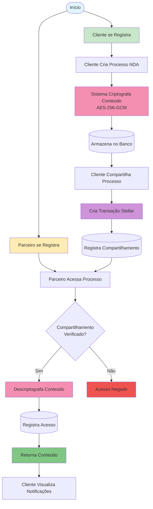

---

## Fluxo de Registro de Usuário

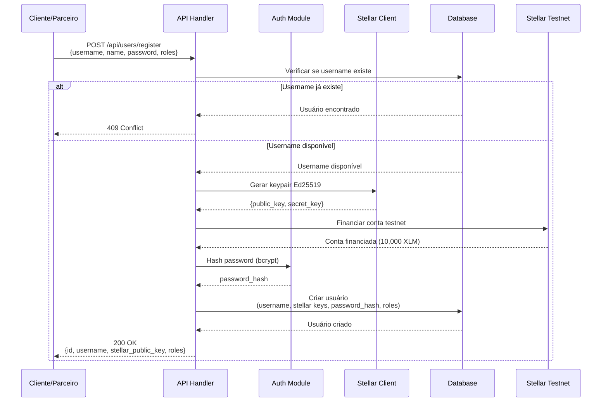

---

## Fluxo de Autenticação

### Login com Senha

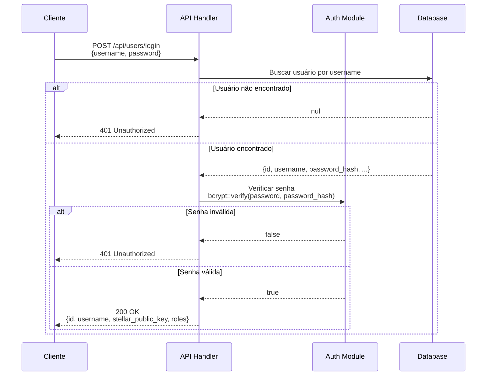

### Auto-Login

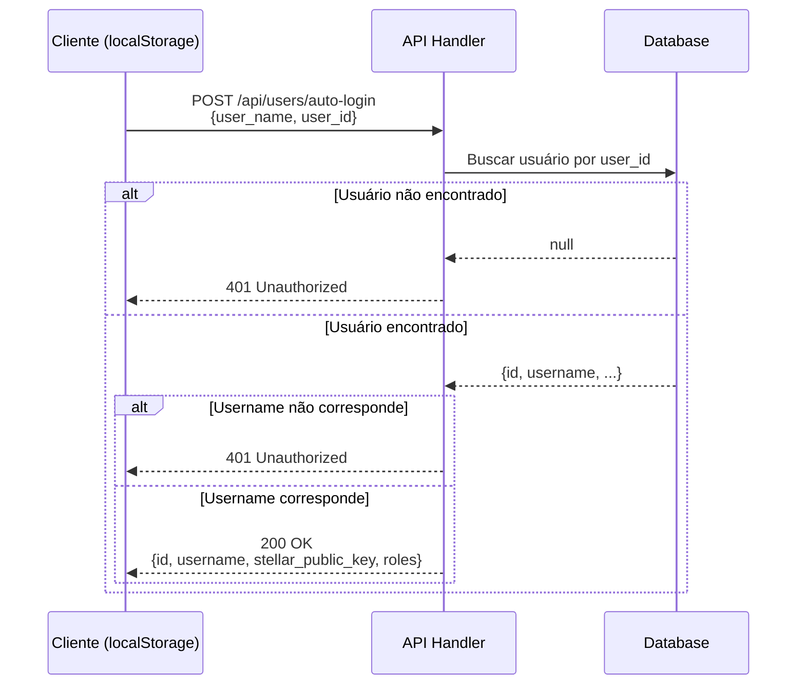

---

## Fluxo de Criação de Processo

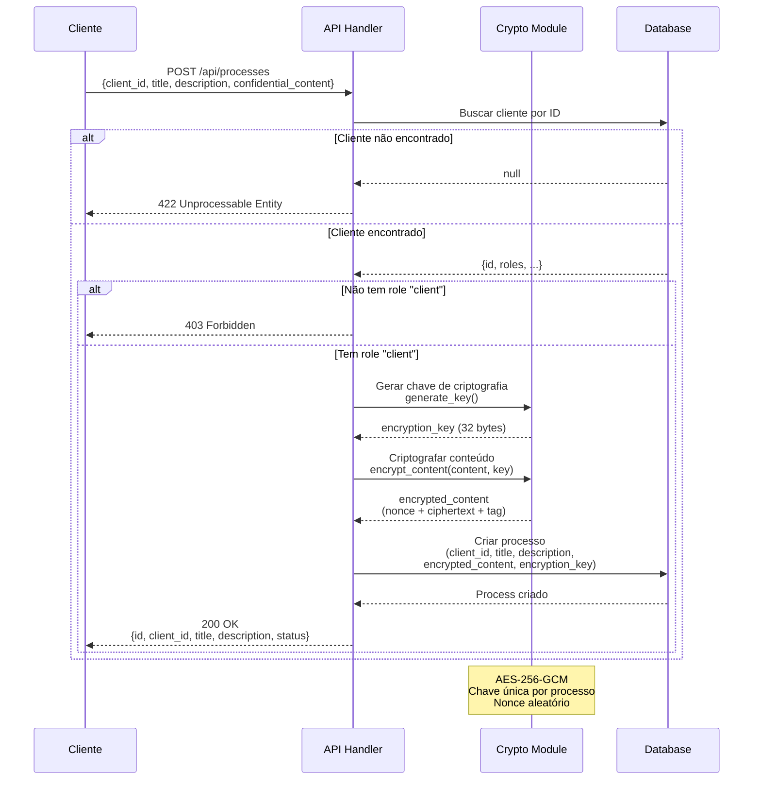

---

## Fluxo de Compartilhamento (Blockchain)

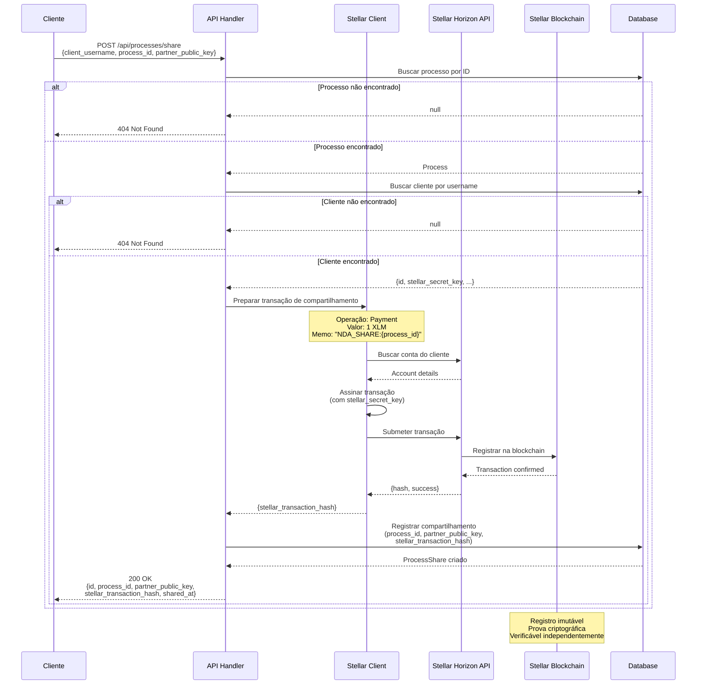

---

## Fluxo de Acesso ao Conteúdo

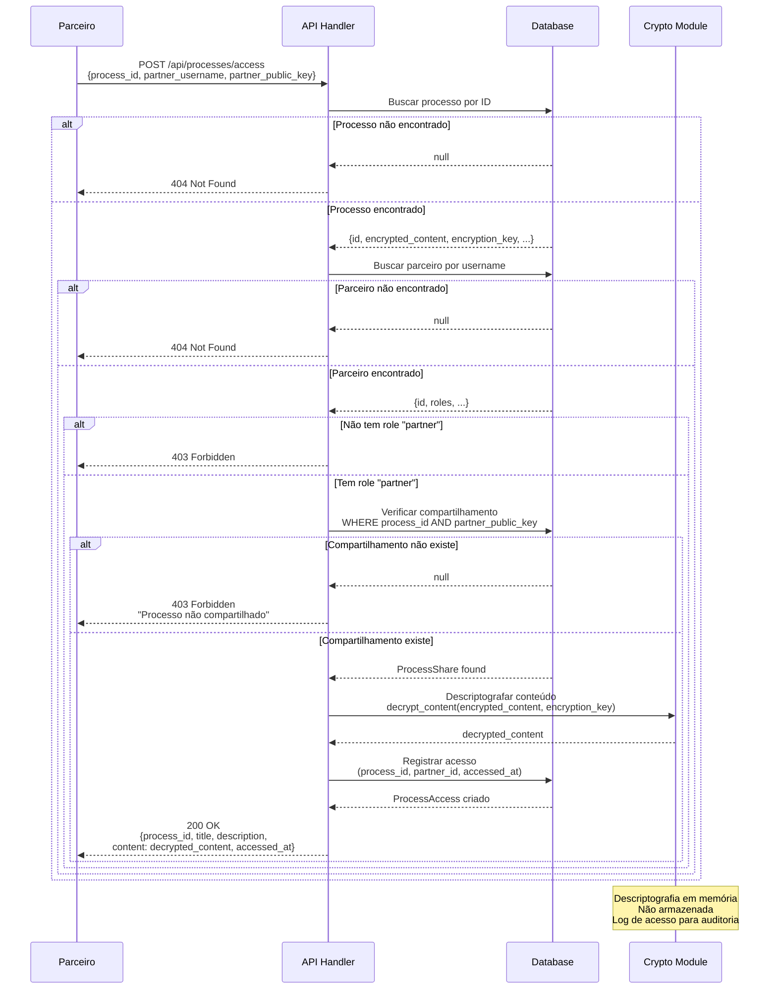

---

## Arquitetura em Camadas

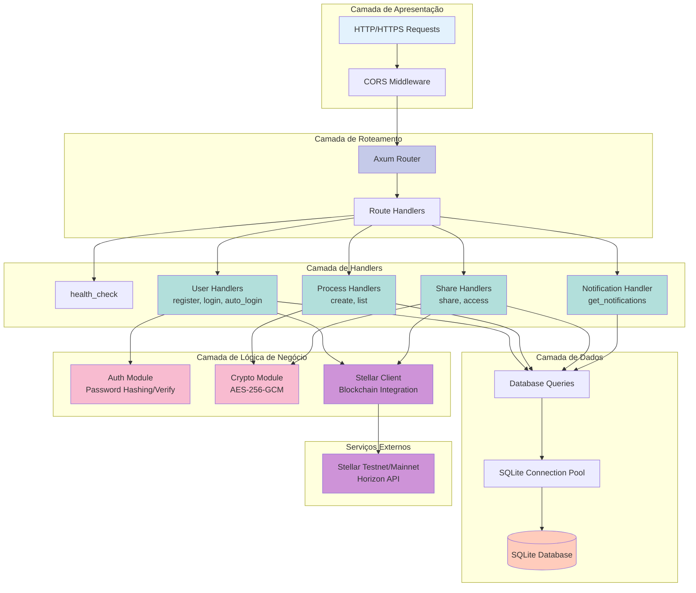

---

## Fluxo de Dados entre Componentes

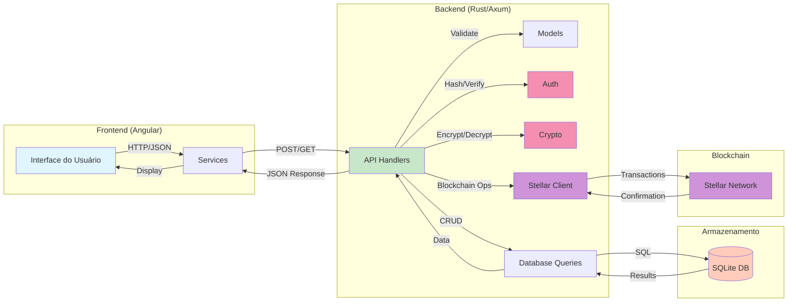

---

## Ciclo de Vida de um Processo

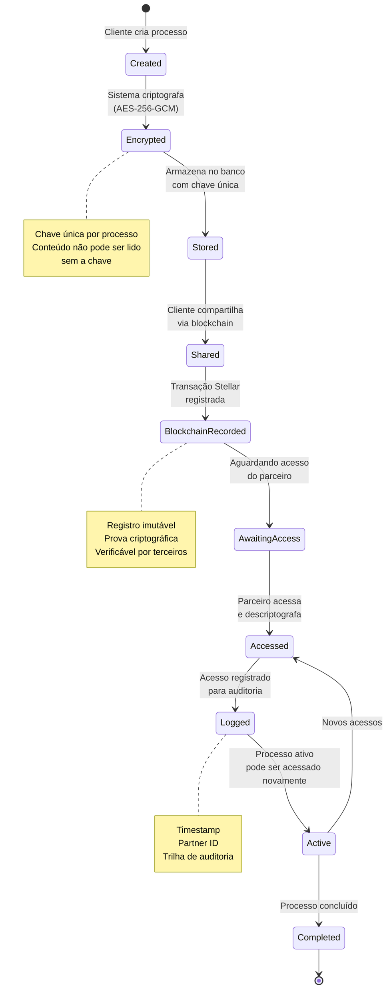

---

## Fluxo de Segurança e Verificações

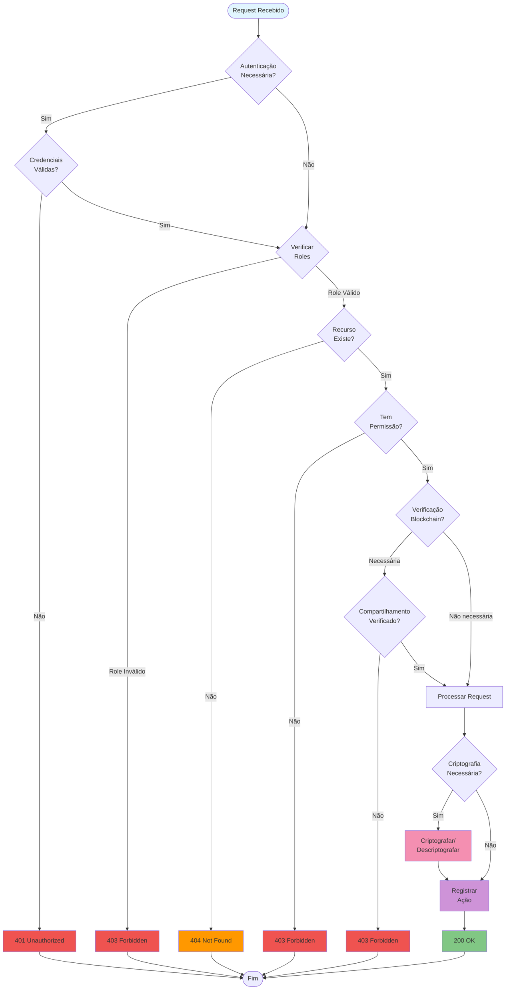

---

## Fluxo de Notificações e Auditoria

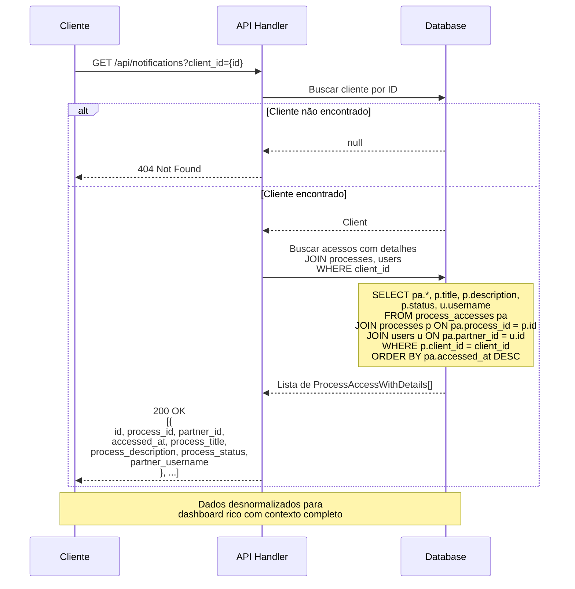

---

## Modelo de Dados e Relacionamentos

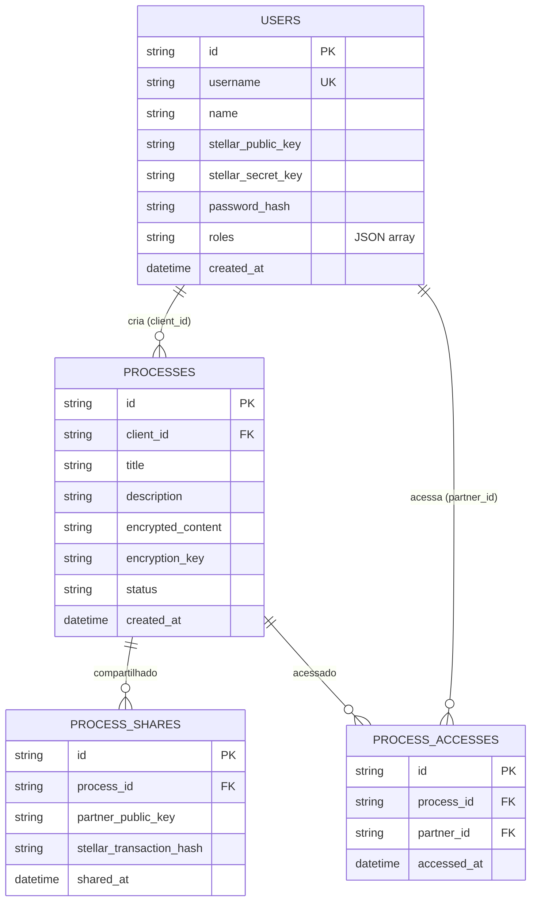

---

## Fluxo de Criptografia Detalhado

```mermaid
graph TB
    subgraph "Criação de Processo - Criptografia"
        Plain[Conteúdo Confidencial<br/>Texto Plano]
        GenKey[Gerar Chave AES-256<br/>32 bytes aleatórios]
        GenNonce[Gerar Nonce<br/>12 bytes aleatórios]
        Encrypt[Criptografar com AES-256-GCM]
        Combine[Combinar:<br/>nonce + ciphertext + tag]
        B64Enc[Codificar Base64]
        StoreEnc[(Armazenar:<br/>encrypted_content + encryption_key)]
    end
    
    subgraph "Acesso ao Processo - Descriptografia"
        RetrieveEnc[(Recuperar:<br/>encrypted_content + encryption_key)]
        B64Dec[Decodificar Base64]
        Split[Separar:<br/>nonce | ciphertext + tag]
        Decrypt[Descriptografar com AES-256-GCM]
        Verify[Verificar Tag de Autenticação]
        PlainOut[Conteúdo Confidencial<br/>Descriptografado]
    end
    
    Plain --> GenKey
    Plain --> GenNonce
    GenKey --> Encrypt
    GenNonce --> Encrypt
    Plain --> Encrypt
    Encrypt --> Combine
    Combine --> B64Enc
    B64Enc --> StoreEnc
    
    StoreEnc -.->|Quando acessado| RetrieveEnc
    RetrieveEnc --> B64Dec
    B64Dec --> Split
    Split --> Decrypt
    Decrypt --> Verify
    Verify -->|Tag válida| PlainOut
    Verify -->|Tag inválida| Error[Erro: Conteúdo<br/>foi alterado]
    
    style Plain fill:#e3f2fd
    style GenKey fill:#f48fb1
    style Encrypt fill:#f48fb1
    style StoreEnc fill:#ffccbc
    style PlainOut fill:#81c784
    style Error fill:#ef5350
```

---

## Integração Stellar Blockchain

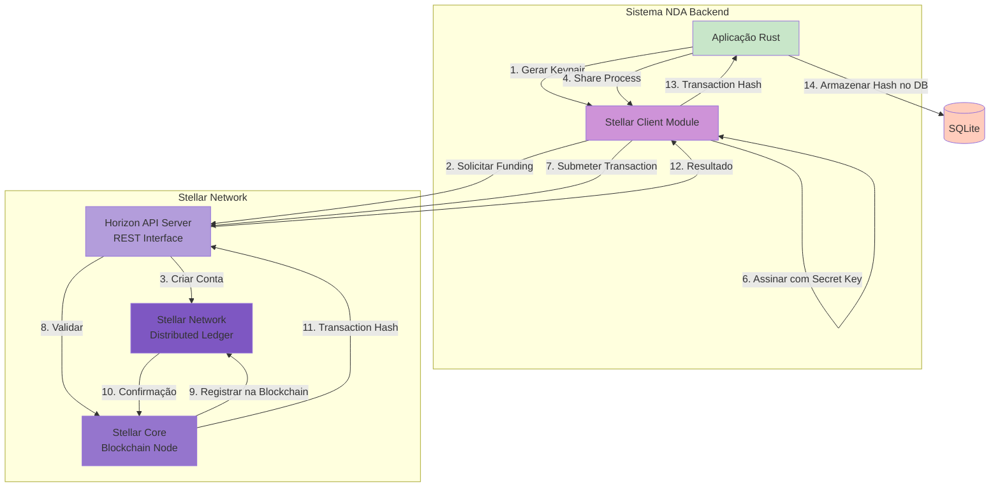

---

## Resumo dos Fluxos Principais

### 1. Registro → Blockchain Account
```
Cliente/Parceiro → API → Gerar Keypair → Financiar Testnet → Hash Password → Salvar DB
```

### 2. Criar Processo → Criptografia
```
Cliente → API → Gerar Chave AES → Criptografar Conteúdo → Salvar DB (encrypted)
```

### 3. Compartilhar → Blockchain Transaction
```
Cliente → API → Stellar Transaction → Blockchain → Salvar Hash no DB
```

### 4. Acessar → Verificação + Descriptografia
```
Parceiro → API → Verificar Compartilhamento → Descriptografar → Registrar Acesso → Retornar Conteúdo
```

### 5. Notificações → Auditoria
```
Cliente → API → Buscar Acessos com JOIN → Retornar Lista com Detalhes
```

---

## Segurança em Múltiplas Camadas

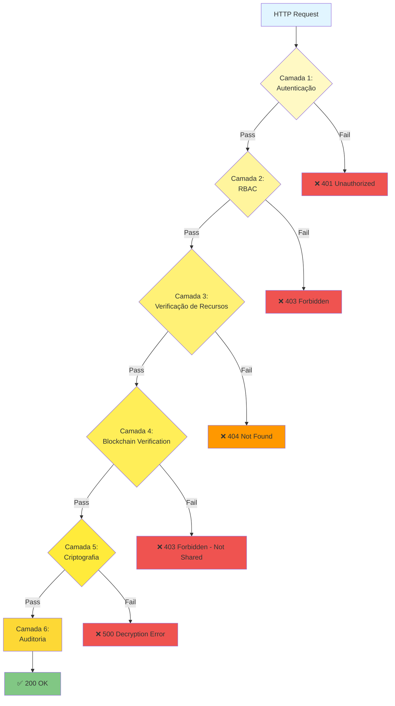

---

## Conclusão

Estes diagramas ilustram os principais fluxos de informação do sistema NDA Backend:

- **Autenticação e Autorização**: Sistema robusto com RBAC
- **Criptografia**: AES-256-GCM com chaves únicas por processo
- **Blockchain**: Integração com Stellar para registros imutáveis
- **Auditoria**: Trilha completa de todos os acessos
- **Segurança em Camadas**: Múltiplos níveis de proteção

Para mais detalhes, consulte:
- [API Reference](API_REFERENCE.md)
- [Architecture Guide](ARCHITECTURE.md)
- [Quick Start](QUICKSTART.md)
